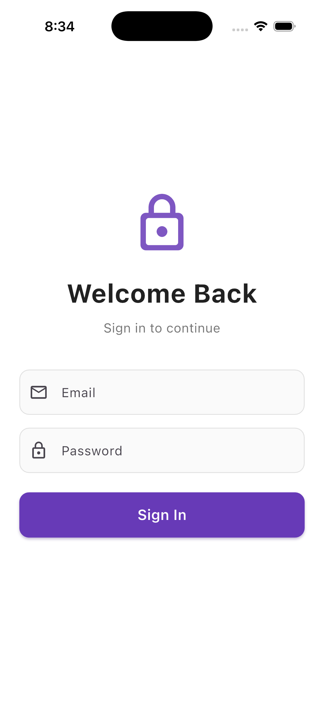
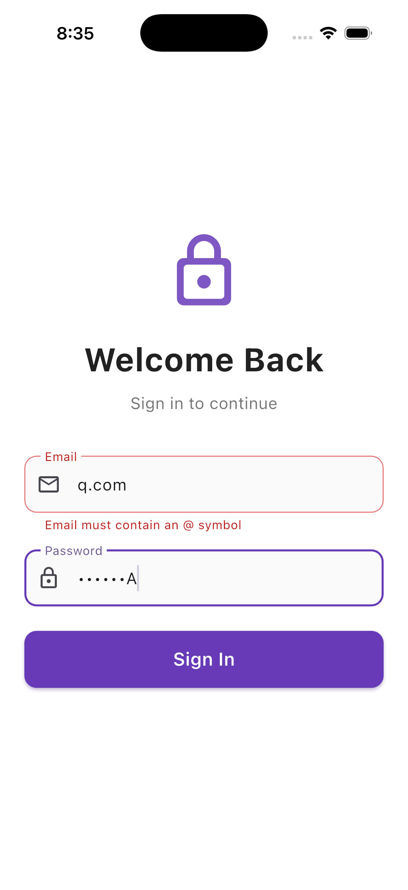
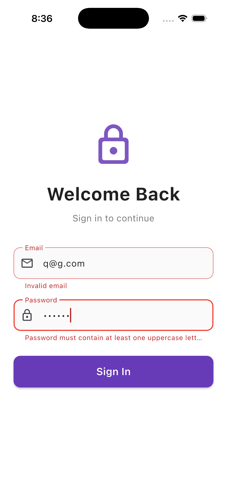

# simple_app

A simple Flutter authentication app with email and password validation.

## Authentication

Use any valid email and password that meets the following requirements:
- **Email**: Valid email format (e.g., user@example.com)
- **Password**: At least 8 characters with uppercase, lowercase, and number

## Screenshots

<table>
  <tr>
    <td></td>
    <td></td>
  </tr>
  <tr>
    <td></td>
    <td></td>
  </tr>
  <tr>
    <td></td>
    <td></td>
  </tr>
</table>
